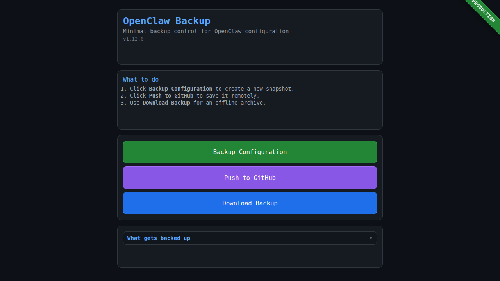

# Release Tutorial v1.12.0

Generated: 2026-02-22T16:41:10.325159Z

## Current use cases

The current OpenClaw Backup app is designed for these day-to-day operations:

- **One-click backup** of OpenClaw configuration and workspace metadata
- **Safe redaction** of sensitive values before storing backup snapshots
- **Git-based history** of backup snapshots for auditability and rollback
- **Push to remote backup repository** with auto-recovery on non-fast-forward
- **Downloadable archive export** for offline copy/transfer
- **Environment-aware operation** (dev/staging/production indicator)

## Current application screenshot

## Scope
- Release type: **minor**
- Test status: **pending**

## Pipeline Overview

## Operator Steps
1. Confirm image published for `v1.12.0` in GHCR and `latest` updated.
2. Restart environments:
   - `backup-staging-restart`
   - `backup-dev-restart`
   - or `backup-all-restart`
3. Verify:
   - `curl http://127.0.0.1:3100/api/status`
   - `curl http://127.0.0.1:3101/api/status`
4. Validate backup + push from UI.

## Test Matrix
- Container starts: required
- `/api/status` version check: required
- `/api/backup`: required
- Push auto-resync behavior: required
- Read-only mount flags: required

